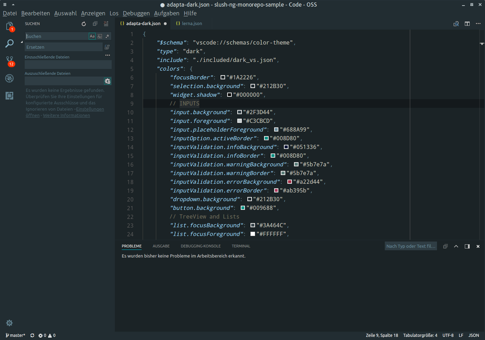

# vscode-theme-adapted

An [Adpata](https://github.com/adapta-project) UI theme for [VSCode](https://github.com/microsoft/vscode) with Monokai or VSCode+ syntax theme. VSIX files can be downloaded from the [releases](https://github.com/about-code/vscode-theme-adapted/releases) page.
Alternatively Linux users can also download sources and extract them to `~/.vscode/extensions`.

